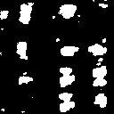

# Satellite Building Segmentation with U-Net

This project implements a U-Net model using TensorFlow 2 to perform semantic segmentation on satellite images for identifying building footprints. This is a binary segmentation task where the model learns to classify each pixel as either "Building" or "Non-Building".

**[Project Status: Completed v1.0]**

---

### Sample Prediction

Below is a sample result from the test set, showing the original satellite image, the actual ground truth mask, and the mask predicted by our trained U-Net model.

| Original Satellite Image | Ground Truth Mask | Predicted Mask |
| :---: | :---: | :---: |
|  |  |  |

---

## 🌟 Overview

The goal of this project was to build and train a deep learning model capable of accurately segmenting building structures from aerial imagery. This technology has critical real-world applications, including:
- Urban planning and development monitoring.
- Disaster response and damage assessment.
- Population estimation and environmental studies.
- **Potential for planetary science:** This same methodology could be adapted for identifying structures or geological features on other planets, like Mars.

---

## 🛠️ Technologies & Architecture

- **Languages:** Python 3.8
- **Core Libraries:** TensorFlow 2.8 (Keras), NumPy, Matplotlib, Pillow
- **Model Architecture:** **U-Net**, a convolutional neural network designed for fast and precise image segmentation.
- **Development Environment:** Jupyter Notebook, VS Code, Conda for environment management.
- **Dataset:** The project uses the "Massachusetts Buildings Dataset" from Kaggle.

---

## 🚀 How to Run This Project

### Prerequisites

- **Conda (Anaconda or Miniconda)** is highly recommended to manage the project's dependencies.
- The preprocessed data, which can be generated by the first notebook.

### Installation & Execution

The project is organized into two separate notebooks for clarity:

1.  **`notebooks/1_Data_Exploration_and_Preprocessing.ipynb`**:
    -   Run this notebook first. It will load the raw dataset, preprocess it, and save the data as `.npy` files in the `data/processed/` directory.

2.  **`notebooks/2_UNet_Model_Training.ipynb`**:
    -   After running the first notebook, run this one to load the processed data, build the U-Net model, train it, and visualize the prediction results. The trained model will be saved in the `saved_models/` directory.

---

## 🔮 Future Work & Vision

While this project successfully demonstrates the concept, there are many avenues for future improvement and expansion:
- [x] **Implement and train a baseline U-Net model.** (Completed)
- [ ] **Hyperparameter Tuning:** Systematically tune hyperparameters (learning rate, batch size, etc.) to improve model accuracy.
- [ ] **Data Augmentation:** Apply more advanced data augmentation techniques to make the model more robust.
- [ ] **Experiment with Different Architectures:** Compare the U-Net model's performance with other segmentation architectures like FCN or DeepLab.
- [ ] **Deployment:** Deploy the trained model as a web application or API for real-world use.

---

## 🙏 Acknowledgments

The foundational concepts and dataset for this project were inspired by the work of [**iamtekson**](https://github.com/iamtekson) and their deep learning tutorials for earth observation.

---